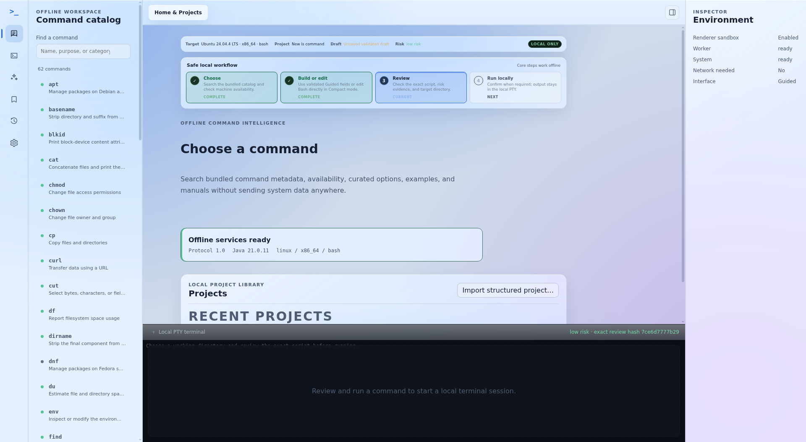
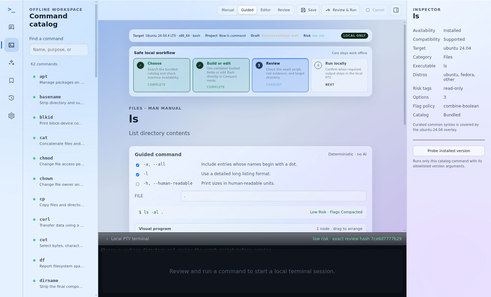
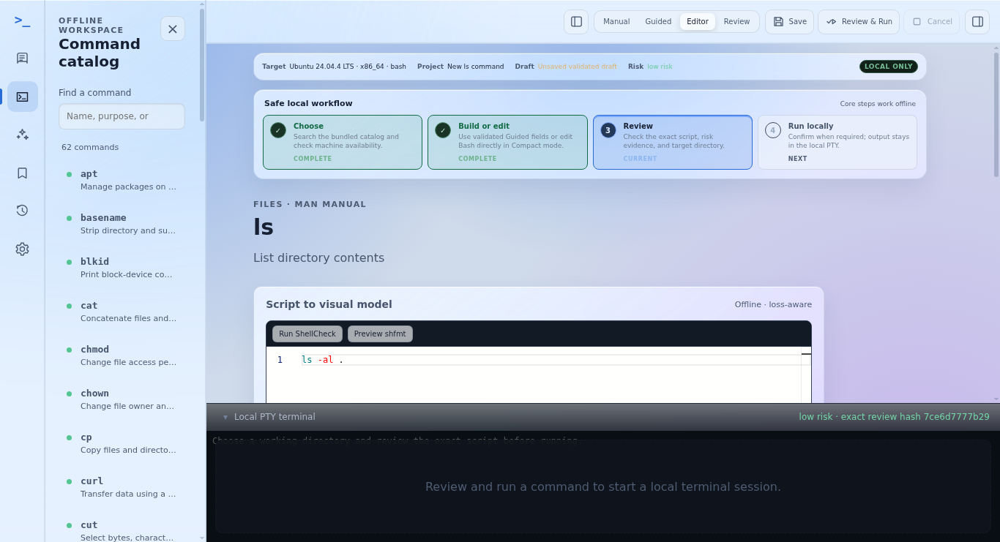
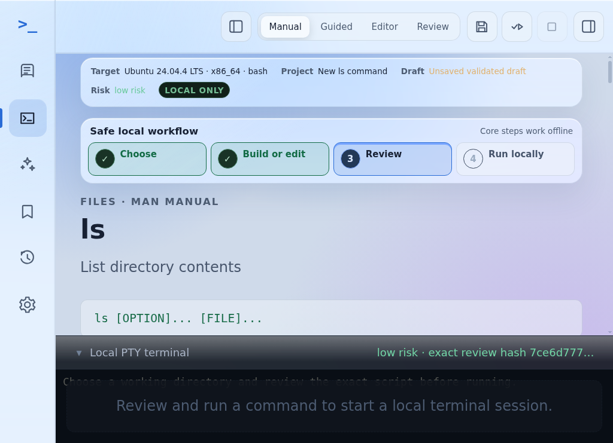
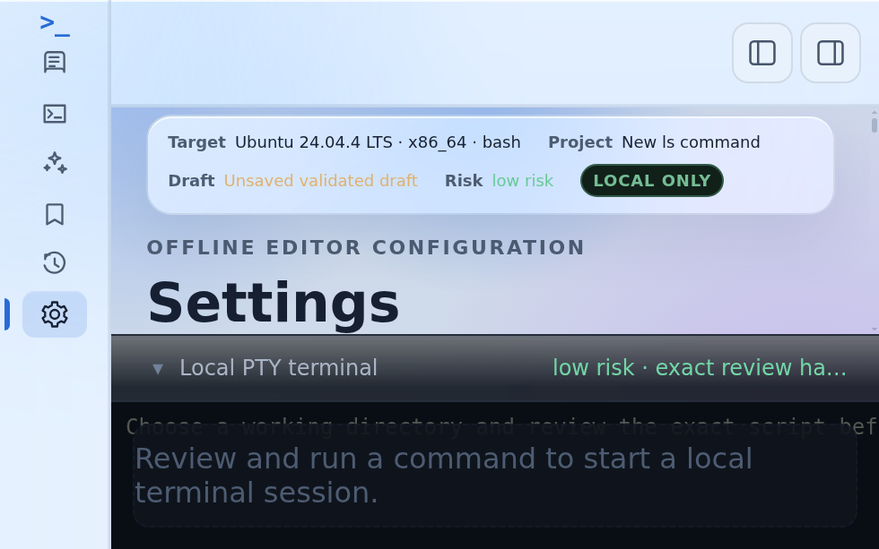

# Command IDE 0.1.0-beta.2 release notes

Status: approved for publication on 2026-08-05.

Codename: **Andromeda**. This codename applies to the complete `0.1.0` release
train; see the [constellation release registry](constellation-codenames.md).

This beta targets Ubuntu 24.04/26.04 LTS and Fedora 44 on x86-64. It includes
the offline catalog/manual viewer, Guided visual builder, Compact Bash editor,
structured projects and bookmarks, deterministic risk review, local PTY
execution, redacted history, and optional proposal-only Ollama/OpenAI support.
The Linux interface supports outer-window sizes from 980×640 through 4K,
Ubuntu scaling from 100% through 200%, resizable panes, System/Light/Dark
appearance, a first-run local workflow, and X11/Wayland display diagnostics.

Beta.2 adds the redesigned contextual Home, Builder, Editor, Manual and
Settings workflows, more translucent light/dark frosted-glass materials, and
correlated structured logs across the renderer, Electron main process and Java
worker. Keyboard focus remains stable while asynchronous catalog results and
responsive panes update.

The application bundles its own minimal Java 21 runtime. Users do not need a
system JDK. AI remains optional; core catalog, editing, validation, export, and
execution workflows remain local.

## Verified interface tour

These screenshots were captured by the native Ubuntu 24.04 GitHub Actions run
for source revision `d5c0efaeae7a59d3825dd3b2a2c9375733528d3b`. They are
unmodified application captures from the automated responsive verification
matrix, not design mockups.

### Offline catalog and wide desktop layout

The wide layout keeps the navigation rail, command catalog, workspace,
inspector, and local terminal visible without document-level scrolling.



### Guided visual builder

Guided mode exposes curated command options, deterministic generation, visible
risk state, and the persistent Save, Review & Run, and Cancel actions.



### Compact Bash editor

Compact mode keeps the same project and safety state while providing the local
Monaco-based Bash workflow. Switching modes does not discard unsaved content.



### Responsive manual workspace

At 1024 by 768 and 150% scaling, the icon rail remains available, secondary
panes collapse, and the manual and terminal retain independent scrolling.



### Minimum window at 200% scaling

At the supported 980 by 640 minimum and 200% scaling, Settings, appearance,
diagnostics, and terminal controls remain reachable through pane-owned
scrolling and compact desktop navigation.



The complete retained verification set contains 162 screenshots across nine
primary workspaces, six outer-window sizes, and 100%, 150%, and 200% scaling.
An additional 108 assertion-only states cover 125% and 175%. The workflow also
checks body overflow, reachable primary actions, responsive breakpoints,
editor/canvas/terminal state preservation, and resize-loop errors.

Remaining publication gates:

- a Fedora 44 clean-VM installer/uninstaller run (the automated container gate
  is complete, but release approval may require this additional record);
- exact-revision release-branch acceptance;
- signed artifact publication and release-blocker triage.

## Download and integrity

After approval, download the AppImage, deb, or rpm and `SHA256SUMS.txt` from the
permanent GitHub Release for the version. Do not treat a temporary Actions
artifact or an uncommitted local candidate as the public beta. Verify the
download from its directory before installation:

```bash
sha256sum --check SHA256SUMS.txt --ignore-missing
```

The filename and checksum must match exactly. Release metadata also includes
CycloneDX SBOMs, third-party notices, and the tested source revision.

## Install and launch

AppImage does not require installation:

```bash
chmod +x command-ide-0.1.0-beta.2-x86_64.AppImage
./command-ide-0.1.0-beta.2-x86_64.AppImage
```

Install the Debian package on Ubuntu:

```bash
sudo apt install ./command-ide-0.1.0-beta.2-amd64.deb
command-ide
```

Install the RPM package on Fedora:

```bash
sudo dnf install ./command-ide-0.1.0-beta.2-x86_64.rpm
command-ide
```

The bundled Java runtime is used automatically; `JAVA_HOME` is not required.

## Upgrade and uninstall

Install a newer downloaded package with the same `apt install ./…deb` or
`dnf upgrade ./…rpm` command after verifying its checksum. AppImage users can
replace the old file after closing the application.

Uninstall a native package with:

```bash
sudo apt remove command-ide
# or
sudo dnf remove command-ide
```

Uninstalling application binaries does not delete local projects, bookmarks,
settings, history, or separately exported files. Remove personal data only
through an intentional backup/removal process after confirming its location.

## Linux troubleshooting

- If AppImage cannot mount because FUSE is unavailable, use
  `APPIMAGE_EXTRACT_AND_RUN=1 ./command-ide-0.1.0-beta.2-x86_64.AppImage`, or
  prefer the
  native deb/rpm package.
- Wayland uses Electron's automatic Ozone backend selection. If a compositor
  has a display-specific defect, launch once with `--ozone-platform=x11` to
  compare behavior and include the result in the bug report.
- VMware guests default to software rendering for startup reliability. Set
  `CMD_IDE_HARDWARE_ACCELERATION=1` before launch only to test the virtual GPU;
  set `CMD_IDE_DISABLE_GPU=1` to request software rendering explicitly. Restart
  after changing either variable.
- Native transparent windows are opt-in with
  `CMD_IDE_NATIVE_TRANSPARENCY=1`; unsupported compositors should retain the
  default opaque native window and in-app frosted materials.
- If Chromium reports an unusable SUID sandbox helper, prefer the deb/rpm
  package or repair the host's user-namespace/package policy. `--no-sandbox`
  disables a Chromium security boundary and is reserved for isolated CI or
  temporary diagnosis, not normal desktop use.
- Start from a terminal with `ELECTRON_ENABLE_LOGGING=1` when collecting startup
  diagnostics. Never include API keys, shell secrets, or private project
  contents in a report.

## Known limitations

- This beta supports Linux x86-64 only: Ubuntu 24.04/26.04 and Fedora 44.
  macOS/Zsh and Windows/PowerShell remain deferred.
- The core catalog, editing, validation, and execution path is offline. OpenAI
  and installed-Ollama providers are optional, proposal-only, and never execute
  commands.
- Native system manual output depends on host availability and safely falls
  back to bundled documentation.
- Native transparency and GPU acceleration depend on the Linux compositor and
  virtual GPU; the reliable opaque/software fallbacks remain supported.
- The beta has no automatic updater, cloud account, SSH execution, telemetry,
  team workspace, or plugin installation surface.

Report defects through the
[GitHub issue tracker](https://github.com/CodeHub2901/visual-command-shell-ide/issues).
Report vulnerabilities using the private process in
[SECURITY.md](https://github.com/CodeHub2901/visual-command-shell-ide/blob/develop/SECURITY.md),
not a public issue. Include the version, package format, distribution, display
session, reproduction steps, and non-sensitive logs.

Native workflow
[run 31009742563](https://github.com/CodeHub2901/visual-command-shell-ide/actions/runs/31009742563)
passed the complete Ubuntu 24.04, Ubuntu 26.04, and Fedora 44 matrix for the
verified `develop` baseline `d5c0efaeae7a59d3825dd3b2a2c9375733528d3b`.
The release-branch and tagged candidates must pass the same matrix for their
own exact revisions before publication.

The native workflow captures real React Flow 1,000-node canvas measurements
and a 4 MiB end-to-end Pty4J/framed-transport measurement for each target.
Install, bundled-runtime launch, PTY, uninstall, and user-data-preservation
results are stored in strict records bound to the source commit and tested
package SHA-256. The complete three-target record set must pass aggregate
verification before publication.

Each candidate now carries deterministic Java, Node, and combined CycloneDX
1.6 SBOMs, complete generated third-party notices, project license/notice
copies, and the bundled runtime module inventory. The release directory
contains a separately verified `SHA256SUMS.txt` covering all three Linux
packages and every metadata file.
